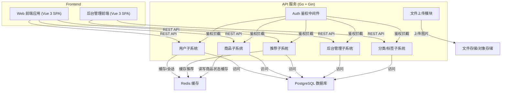
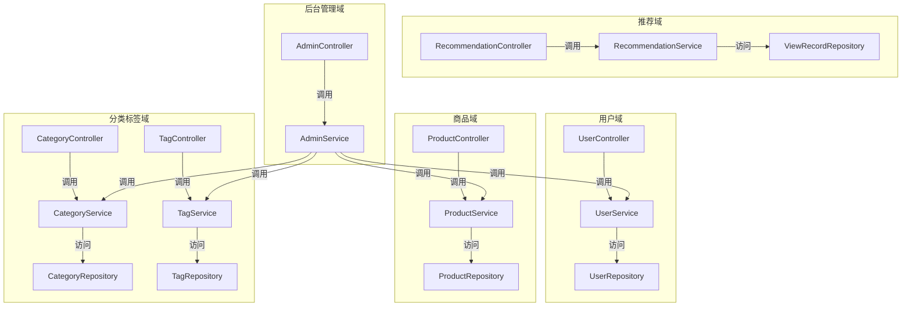
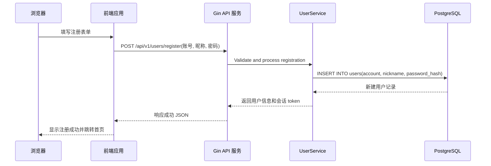
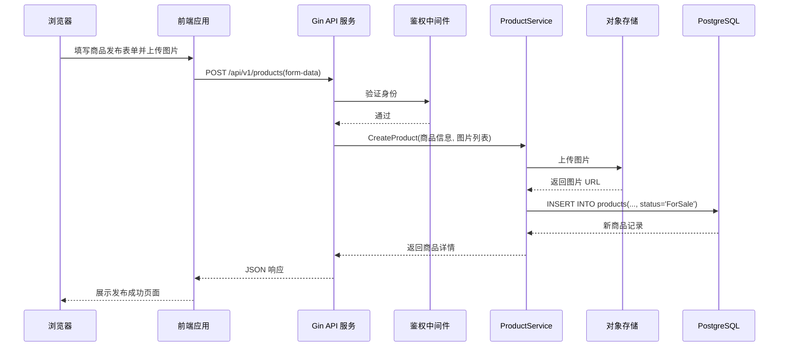
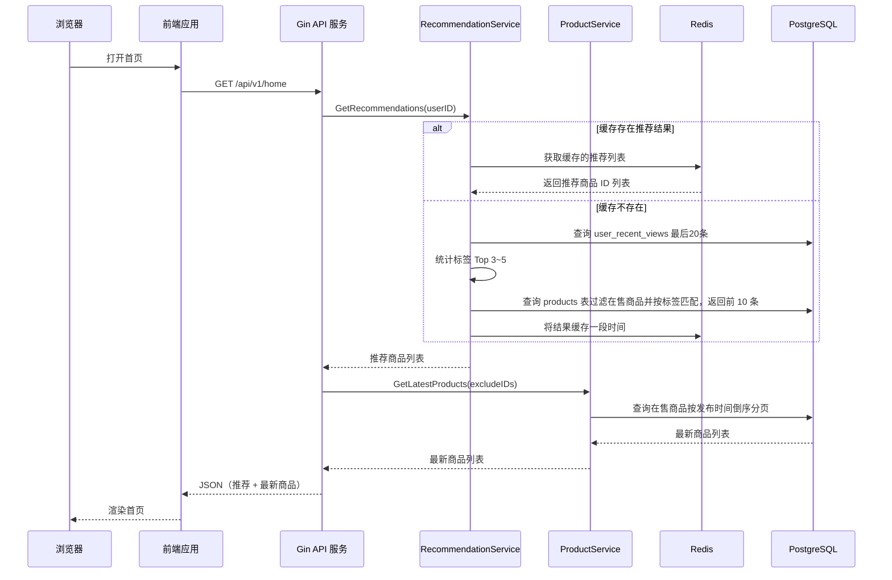
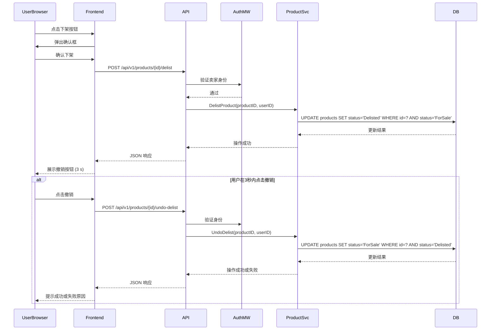
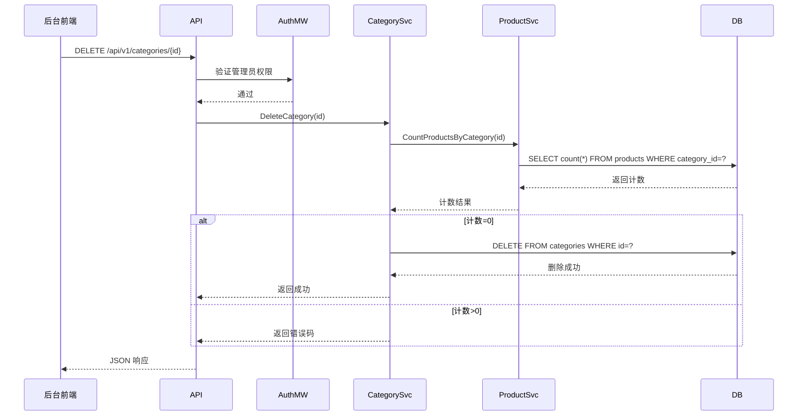
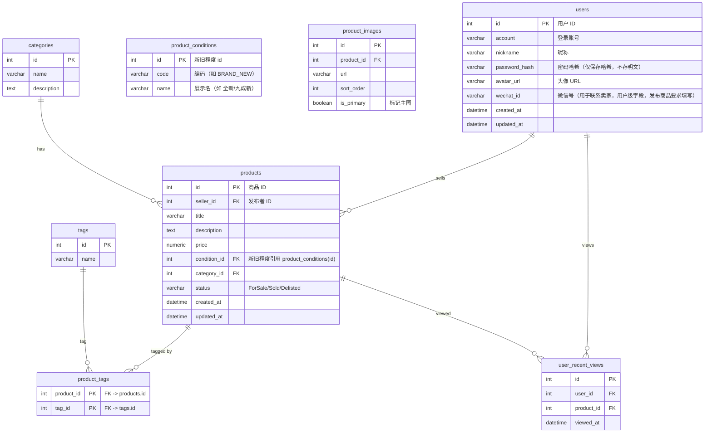

## 1. 文档概述

本文件用于描述校园二手交易推荐系统的软件体系结构。该系统面向校园学生用户，提供商品的发布、浏览、搜索、分类查看、标签推荐等功能，并包含用于平台数据维护的后台管理模块。本设计文档旨在为详细设计、开发、测试及部署提供统一的架构指导，确保系统在性能、可靠性、可扩展性和可维护性方面满足需求。文档覆盖前端应用、后端服务、数据库和必要的基础设施，不涉及界面交互细节。

## 2. 系统概述

### 2.1 业务背景
随着校园二手交易需求的增加，学生希望快速发现合适的二手商品并完成线下交易。当前存在的信息分散、低效的问题：学生往往依赖线下海报或群消息，缺乏统一的平台展示与筛选。为此，本系统提供一个供学生用户自由发布、浏览和搜索商品的在线平台，并通过标签匹配算法为用户推荐可能感兴趣的商品，提升发现效率。此外，管理员可通过后台维护分类和标签，从而维持平台内容的结构化和可用性。

### 2.2 核心功能
1. **用户注册/登录**：支持学生用户注册新账号、登录与注销，提供会话管理和“记住我”功能。
2. **个人信息管理**：登录用户可修改头像、昵称、密码与联系方式（微信号）；系统限制昵称修改频率并验证旧密码。
3. **商品发布与管理**：登录用户发布新商品并填写标题、描述、价格、图片、分类与标签；可编辑未售出或已下架的商品；执行上架与下架操作，遵循商品状态机规则；对于已售商品，状态字段为终态不可逆，但平台允许管理员在后台对非状态字段（标题/描述/分类/标签等）做纠错或数据清洗更新。
4. **浏览与搜索**：支持所有用户（含访客）浏览首页最新商品、分类列表、搜索结果和商品详情；登录用户在首页可看到个性化推荐列表，结果依据最近浏览记录的标签统计。
5. **推荐与浏览记录**：系统维护用户最近 20 条浏览记录，基于标签高频匹配生成“猜你喜欢”列表，并在首页展示。新用户或无浏览记录时显示最新在售商品。
6. **后台管理**：管理员登录后台系统后，可维护分类和标签、查看用户及商品列表，并查看系统整体数据指标。删除分类/标签前检查是否被引用。

### 2.3 系统使用场景
- **学生用户**：在校园内使用浏览器访问前端应用，注册登录后发布商品，浏览搜索他人商品，联系卖家线下交易，管理自己的商品和个人信息。
- **访客**：未登录用户可以浏览首页、分类和商品详情，但在需要认证的操作（发布、联系卖家）时被引导登录注册。
  - 隐私说明：卖家微信号仅对已登录的且非卖家的用户展示；未登录用户或商品的发布者本人不可见卖家微信号（后端在接口层做过滤）。
- **管理员**：通过后台系统登录，查看平台统计数据，维护分类和标签。

### 2.4 系统边界
系统包含一个前端单页应用（SPA）和一个后端服务。前端负责页面展示与用户交互；后端提供 REST API、认证鉴权和业务逻辑处理，并与 PostgreSQL 数据库和文件存储交互。系统不提供线上支付，也不与第三方支付平台对接；所有交易在线下完成。外部依赖主要为文件存储（可使用对象存储服务或本地磁盘）和缓存服务（可选，如 Redis）。

### 2.5 关键用例
| 用例名称            | 简述                                                                                                                                                                                              |
| ------------------- | ------------------------------------------------------------------------------------------------------------------------------------------------------------------------------------------------- |
| 学生用户注册        | 访客访问注册页面，填写账号、昵称和密码，系统完成唯一性校验并创建用户账号。                                                                                                                        |
| 学生用户登录        | 已注册用户输入账号和密码，系统验证并返回会话令牌，用于后续认证。                                                                                                                                  |
| 发布商品            | 登录卖家填写商品信息并上传图片，系统校验后将新商品存入数据库，状态为“在售”。                                                                                                                      |
| 修改商品信息        | 卖家在“在售”或“已下架”状态下修改商品价格、描述等信息，不改变状态。                                                                                                                                |
| 上/下架商品         | 卖家将“在售”商品下架或将“已下架”商品重新上架，系统执行合法状态流转；已售商品状态为终态，不允许更改状态；普通卖家默认不可修改已售商品，但管理员可在后台编辑已售商品的非状态字段用于纠错/数据清洗。 |
| 浏览首页并获取推荐  | 用户访问首页，系统返回最新在售商品列表；若登录，系统基于最近浏览记录的标签计算并返回推荐商品。                                                                                                    |
| 搜索商品            | 用户在搜索框输入关键字，系统返回匹配标题、描述、分类和标签的在售商品，支持价格和时间筛选。                                                                                                        |
| 查看商品详情        | 用户点击任意商品查看其完整信息，并可联系卖家；系统在后台记录浏览行为。                                                                                                                            |
| 管理员维护分类/标签 | 管理员在后台增改查分类/标签，删除前检查是否被商品引用。                                                                                                                                           |

## 3. 设计原则

以下为本系统在架构设计阶段遵循的主要原则（7 条），每条简洁说明及对系统的影响：

1. **分层与模块化**：按表现层、业务层、数据层分层，每层职责清晰，禁止跨层直接调用；业务按领域（用户、商品、推荐、后台管理）进一步划分，保证高内聚、低耦合并便于单独维护与扩展。

2. **接口优先**：先定义稳定清晰的接口（API 契约），再实现内部逻辑；接口采用 REST 风格设计，数据格式统一为 JSON，便于前后端解耦与自动化测试/文档生成。

3. **优先重用**：充分利用成熟的框架与库（如 Gin 的路由与中间件、GORM 访问 PostgreSQL、Vue 3 及前端 UI 组件库），避免重复造轮子，降低维护成本并提高开发效率。

4. **安全优先于便利**：对所有敏感操作执行身份认证和权限校验；重要数据采用加密存储；并通过输入校验、参数化查询等手段防止越权与注入攻击，保证平台安全性。

5. **扩展与弹性**：核心服务设计为无状态应用以便横向扩展；将推荐算法等计算型任务拆分为独立模块或异步任务，便于未来引入消息队列或微服务以提升弹性与可维护性。

6. **配置与代码分离**：数据库连接、缓存地址、外部服务凭证等环境信息通过配置文件或环境变量提供，便于在开发/测试/生产环境之间切换并支持容器化部署。

7. **异常与日志统一**：实现统一的异常处理与错误码规范，输出结构化日志并包含链路追踪字段（如请求 ID），以支持快速定位与问题排查。

## 4. 设计约束和现实限制

### 技术栈规定
- 前端：Vue 3 + TypeScript + Vite 构建单页应用；状态管理使用 Pinia；UI 库推荐 Element Plus。后台管理界面亦采用 Vue 3。
- 后端：Go 1.20+，基于 Gin 框架提供 HTTP 服务。
- 数据库：PostgreSQL。
- 对象存储：用于商品图片的存储可选本地文件系统或第三方对象存储（S3 兼容服务等）。
- 缓存（可选）：Redis，用于热点数据和性能优化。

### 运行环境
- 服务器运行在 Linux 平台（建议使用主流发行版如 Ubuntu、Debian 或 CentOS），应用部署采用容器化（Docker）。
- 数据库运行在独立服务器或云数据库服务（如 AWS RDS、云厂商托管服务）。
- 文件存储：磁盘容量与 IOPS 要满足图片上传、访问和备份的需求；考虑按需扩容和归档策略。
- 推荐模块默认与后端应用部署在同一进程/容器内；可根据负载拆分为独立服务或异步任务处理以提升弹性。

### 外部接口限制
- 系统不涉及线上支付、物流、短信等第三方业务接口；除图片上传外，不依赖外部服务（如第三方鉴权、社交登录等）。

### 业务规则限制
- 商品库存始终为 1（单件商品模型）。
- 商品状态机：主要遵循“在售 → 已下架 → 在售”循环；当商品变为“已售”状态后其状态字段为不可逆终态，禁止状态流转；但平台允许管理员对已售商品的非状态字段进行必要的纠错或数据清洗更新（不会改变其已售事实）。
- 管理员权限限制：管理员仅可维护分类和标签，不支持强制下架用户商品或封禁用户（此类操作属业务策略可视需要在后续版本扩展）。

## 5. 总体架构概览

本系统采用**前后端分离 + 分层单体服务架构**。前端为 Vue 3 开发的单页应用（SPA），通过 REST API 访问后端。后端采用单体部署，内部按控制层（Controller）、业务层（Service）、持久化层（Repository）划分模块，并在领域上进一步拆分包结构（如用户、商品、推荐、后台管理）。整体可部署为多个实例并通过 Nginx 或服务网关进行负载均衡。

数据层使用 PostgreSQL 保存关系数据；Redis（可选）用于会话、热点数据与推荐缓存；对象存储或静态资源服务器用于存储商品图片和静态资源。

### 5.1 总体架构图



该图强调：前端通过 REST API 访问后端服务；后端内部包含多个子系统并由鉴权中间件统一拦截；数据主要存放在 PostgreSQL，缓存用于提升性能，图片文件存储在对象存储或静态文件服务中。

### 5.2 技术选型与质量目标关联
下面的表格说明关键技术选型、选型理由与它们对质量目标支持的关系：

| 技术组件            | 选型理由                                                                          | 对质量目标的支持                                                               |
| ------------------- | --------------------------------------------------------------------------------- | ------------------------------------------------------------------------------ |
| Vue 3 SPA           | Vue 3 提供更小的包体积、更快的渲染和可扩展性；与 Vite 配合提供优秀的开发体验。[2] | 提高前端性能与用户体验，支持按需加载与组件复用，便于维护。                     |
| Gin (Go Web 框架)   | Gin 基于高效路由与低内存占用，支持中间件与异常恢复机制。[4][6]                    | 提供高并发响应能力；中间件支持统一鉴权、日志和异常处理，提高可用性与可维护性。 |
| PostgreSQL          | PostgreSQL 是可靠的关系型数据库，提供 ACID、一致性和丰富的索引/查询能力。[3]      | 支持复杂查询、事务保证数据一致性；可通过索引与分片优化性能，提高可靠性。       |
| Redis（可选）       | 高性能键值缓存，适合会话、热点数据与推荐结果缓存                                  | 减少数据库读负载，降低延迟，在高并发下提升系统响应速度。                       |
| 对象存储 / 文件系统 | 适合保存大量静态图片、视频资源，支持横向扩展与 CDN 分发                           | 将大量静态资源隔离出应用服务，提高扩展性与性能；支持高并发访问与备份策略。     |

注：以上选型兼顾性能、可用性、可维护性与可扩展性，并直接支持第 3 章中定义的质量目标（性能、可用性、安全性与可扩展性）。

## 6. 逻辑视图（结构视图）

系统按照业务域进行模块化划分，每个模块在代码中对应独立包或子包，内部遵循控制器（Controller）、服务（Service）、持久化（Repository）三层结构。模块之间通过接口调用，避免直接依赖实现。下图展示了主要业务模块之间的关系：



模块卡片：

| 模块名称     | 职责概述                                                                                              | 依赖模块                   | 对应详细设计章节  |
| ------------ | ----------------------------------------------------------------------------------------------------- | -------------------------- | ----------------- |
| 用户模块     | 提供用户注册、登录、退出、资料更新、密码修改等功能；统一管理会话；校验用户权限。                      | 无（基础模块）             | 详细设计第 3.1 节 |
| 商品模块     | 负责商品的发布、编辑、上架/下架、展示、搜索和状态机校验；上传图片并关联元数据。                       | 分类标签模块、用户模块     | 详细设计第 3.2 节 |
| 商品详情     | 在商品详情展示区需读取发布者 `users.wechat_id` 作为联系方式（仅在满足展示条件时返回，详见详细设计）。 | 用户模块                   | 详细设计第 3.2 节 |
| 推荐模块     | 记录用户浏览行为，统计标签出现次数，根据高频标签在在售商品中匹配推荐结果。                            | 商品模块、用户模块         | 详细设计第 3.3 节 |
| 分类模块     | 管理商品分类的增删改查，提供分类列表和分类下商品查询接口。                                            | 商品模块                   | 详细设计第 3.4 节 |
| 标签模块     | 管理商品标签的增删改查，商品发布和推荐时使用标签。                                                    | 商品模块                   | 详细设计第 3.4 节 |
| 后台管理模块 | 为管理员提供仪表盘、用户/商品列表查询以及分类/标签维护接口。                                          | 用户、商品、分类、标签模块 | 详细设计第 3.5 节 |

以上分层与模块划分有助于实现关注点分离、职责明确、便于扩展的系统架构；详细设计阶段将为每个模块生成类图、接口规范与顺序图，以支持具体实现与测试。

## 7. 开发视图（代码组织视图）

本节描述开发视图中代码仓库、前端、后端结构及其映射关系，便于开发人员快速定位实现位置与遵循约束。

### 7.1 工程整体结构
系统采用前后端分离架构，代码仓库划分如下：

```text
project-root/
├─ frontend/          # 前端项目，Vue 3 SPA
├─ admin-frontend/    # 后台管理前端项目
├─ backend/           # 后端单体应用（Go + Gin）
└─ common/            # 公共库，如工具类、模型定义
```

各工程职责：
- `frontend/`：面向学生用户的 Web 应用，负责首页、分类页、搜索页、商品详情页、个人中心等页面展示和交互；调用后端公开 API。
- `admin-frontend/`：面向管理员的 Web 应用，提供后台仪表盘、用户/商品/分类/标签管理的界面；调用后端管理 API。
- `backend/`：提供统一的 REST 接口，包含用户、商品、推荐、分类、标签、后台管理等子系统，实现业务逻辑、数据访问、文件上传和鉴权。
- `common/`：存放公共工具类、错误码定义、统一响应结构、数据库模型对象等，供后端子系统复用。

系统为前后端分离 + 后端单体模式；未来如需扩展为微服务，可拆分 `backend` 中的子系统为独立服务，通过服务注册与 API 网关协同。

### 7.2 前端项目结构
前端使用 Vue 3 + TypeScript + Vite 开发，按照业务模块划分目录。主要目录结构示意：

```text
frontend/src/
├─ api/            # 封装所有后端接口调用，统一处理请求和响应拦截
├─ views/          # 页面视图，每个路由对应一个页面目录
│  ├─ home/        # 首页及推荐模块页面
│  ├─ product/     # 商品发布、编辑、详情页
│  ├─ search/      # 搜索结果页
│  ├─ category/    # 分类列表页
│  ├─ user/        # 登录、注册、个人中心页面
│  └─ ...
├─ components/     # 可复用的 UI 组件（导航栏、分页器、商品卡片）
├─ stores/          # 状态管理（Pinia），存储用户信息、会话等
├─ router/         # 前端路由配置
└─ assets/         # 静态资源（图片、样式）
```

前端每个 `views` 子目录对应逻辑视图中的业务模块：`home` 对应推荐模块和首页展示；`product` 对应商品模块；`user` 对应用户模块；`category` 对应分类模块等。接口调用通过 `api/` 封装，避免在页面中直接写 HTTP 请求。

### 7.3 后端项目结构
后端为单体工程，主要采用分层结构，示例目录如下：

```text
backend/
├─ cmd/                # 入口程序，初始化路由、中间件、配置加载
├─ config/             # 配置文件解析，读取数据库/缓存等配置
├─ controller/         # 控制器层，处理 HTTP 请求，参数校验，调用服务层
│   ├─ user/           # 用户相关控制器
│   ├─ product/        # 商品相关控制器
│   ├─ recommend/      # 推荐相关控制器
│   ├─ category/       # 分类控制器
│   ├─ tag/            # 标签控制器
│   └─ admin/          # 管理员控制器
├─ service/            # 服务层，封装业务逻辑，组合多个仓库操作
│   ├─ user/
│   ├─ product/
│   ├─ recommend/
│   ├─ category/
│   ├─ tag/
│   └─ admin/
├─ repository/         # 持久化层，封装数据库访问
│   ├─ user_repo.go
│   ├─ product_repo.go
│   ├─ view_record_repo.go
│   ├─ category_repo.go
│   └─ tag_repo.go
├─ model/              # 领域模型定义（Go struct）
├─ middleware/         # 自定义中间件，如鉴权、日志、事务管理
├─ util/               # 工具类，如密码加密、错误处理、时间工具
└─ router/             # 路由注册，按模块将控制器绑定到路由
```

各层职责：
- `Controller`：接收并解析 HTTP 请求，做参数基本校验，调用相应的 `Service`，返回统一格式的响应；不直接访问数据库。
- `Service`：实现业务逻辑，对领域模型进行操作；调用 `Repository` 完成数据持久化；在必要时处理事务、调用缓存和其他 `Service`。
- `Repository`：封装数据库访问，包括建表、查询、插入、更新等；使用 ORM（GORM）或 SQL 操作 PostgreSQL；不包含业务逻辑。
- `Model`：定义领域实体结构，与数据库表结构一一对应；标注字段类型及约束。
- `Middleware`：用于身份鉴权、日志记录、请求限流、异常恢复等横切关注点。

禁止控制器直接调用 `Repository` 或跨模块 `Service` 的具体实现；`Service` 间调用须通过接口抽象实现，以降低耦合度。

### 7.4 公共库与代码复用
公共库示例及用途：

| 公共库             | 内容                                                              | 被使用模块             |
| ------------------ | ----------------------------------------------------------------- | ---------------------- |
| `common/resp`      | 定义统一的响应格式（状态码、数据、消息）；封装成功/失败返回方法。 | 所有控制器             |
| `common/errors`    | 定义系统的错误码和错误类型；提供包装错误的方法。                  | 所有层（尤其 Service） |
| `common/auth`      | 实现会话令牌生成与验证、Gin 鉴权中间件。                          | Controller、Middleware |
| `common/util`      | 提供密码哈希与验证、随机字符串生成、时间处理等工具。              | Service、Repository    |
| `common/validator` | 封装参数校验逻辑，支持自定义校验器。                              | Controller             |

这些公共库统一了响应结构、异常处理和工具函数，减少重复代码，并确保不同模块遵循一致的编码规范。

### 7.5 逻辑视图到代码的映射
逻辑视图中的每个业务模块在后端对应一个 `controller/` 子目录和 `service/` 子目录，在持久化层对应一个或多个 `repository` 文件；在前端则对应 `views/` 下的页面目录和 `api/` 调用封装。映射示例如下：

| 逻辑模块     | 后端实现位置                                                                    | 前端实现位置                           |
| ------------ | ------------------------------------------------------------------------------- | -------------------------------------- |
| 用户模块     | `controller/user/`, `service/user/`, `repository/user_repo.go`                  | `views/user/`, `store/user.ts`         |
| 商品模块     | `controller/product/`, `service/product/`, `repository/product_repo.go`         | `views/product/`                       |
| 推荐模块     | `controller/recommend/`, `service/recommend/`, `repository/view_record_repo.go` | `views/home/` (推荐模块)               |
| 分类模块     | `controller/category/`, `service/category/`, `repository/category_repo.go`      | `views/category/`                      |
| 标签模块     | `controller/tag/`, `service/tag/`, `repository/tag_repo.go`                     | 标签功能分散在商品发布页和后台管理页面 |
| 管理后台模块 | `controller/admin/`, `service/admin/`                                           | `admin-frontend/src/` 下各页面         |

这种映射方式让开发人员可以快速定位某个用例或业务逻辑在代码中的位置，便于协同开发和维护。

### 7.6 与详细设计的衔接
本开发视图为详细设计提供了“施工图”。详细设计中的类图应落在上述 `service/`、`controller/` 等目录下；顺序图涉及的对象对应这些包中的具体类。数据库表设计将在详细设计的数据库设计章节展开；接口文档将在详细设计的接口规范章节中具体定义。开发层面的结构约束（如 Controller 不直接访问 Repository）应在详细设计和编码阶段严格遵守。

## 8. 运行视图 / 进程视图

**目的：描述运行时的进程、线程、并发与同步机制。**

### 8.1 运行时组件
运行时系统包括以下进程与组件：
1. **Nginx / 负载均衡器**：面向公网接受 HTTP/HTTPS 请求，将请求分发到多个后端实例；同时可提供静态资源（前端构建后的静态文件和图片）。
2. **前端单页应用（学生端）**：部署为静态文件，由浏览器加载，不包含服务器进程。
3. **后台管理前端应用**：同上，由管理员浏览器加载静态资源。
4. **后端 API 服务实例**：一个或多个 Go 进程运行 Gin 应用，负责接收请求、执行业务逻辑并访问数据库与缓存。
5. **PostgreSQL 数据库**：独立数据库实例，提供持久化存储与事务服务。
6. **对象存储 / 文件服务**：负责存储商品图片等二进制静态资源，可为本地文件系统或 S3 兼容服务。

### 8.2 服务间通信
- **前端 ↔ 后端**：通过 HTTPS 发送 JSON 格式的 REST 请求，后端返回 JSON 格式统一响应。
- **后端 ↔ 数据库**：通过 PostgreSQL 协议使用官方驱动或 ORM（如 GORM）访问，并启用连接池以复用连接。
- **后端 ↔ 缓存**：通过 Redis 客户端连接，存储会话或热点数据；采用合适的过期策略和键命名规范。
- **后端 ↔ 对象存储**：通过文件系统或第三方对象存储 API 上传/下载文件，返回并存储文件 URL。

### 8.3 关键运行时场景顺序图
下面选取三个核心业务场景，用 Mermaid 顺序图描述系统组件在运行时的交互。顺序图关注模块/服务级别；详细的类与方法调用将在详细设计中展开。

#### 场景一：用户注册
触发者：访客；前置条件：未登录。



该流程展示注册中的核心模块交互；详细设计中将给出 `UserController.Register()`、`UserService.Register()` 的参数校验、密码加密与事务处理等实现细节。

#### 场景二：发布商品
触发者：已登录用户；前置条件：用户已登录、商品信息完整。



该图强调文件上传与商品状态设置；详细设计将规定图片大小和格式限制、事务回滚策略、以及多文件上传的原子性处理。

#### 场景三：首页推荐计算
触发者：登录用户访问首页；前置条件：用户已产生浏览记录或无浏览记录。



该顺序图展示推荐流程与缓存策略、去重逻辑，并指出缓存键设计和并发控制的考虑。详细设计阶段将给出推荐算法的伪代码、缓存有效期与并发限流策略。

## 9. 关键场景视图

本节对几个关键业务/技术场景进行说明，并为每个场景提供高层顺序图。详细设计将基于这些场景进一步细化到类级顺序图。

### 9.1 用户登录
触发者：学生用户；前置条件：用户已注册；后置条件：系统生成会话 token 并返回前端。

场景描述：用户在登录页面输入账号与密码，前端将信息发送给后端。后端验证账号是否存在以及密码是否匹配（使用加盐哈希比较）。验证通过则生成会话 token（如 JWT 或随机字符串），并在 Redis 或数据库保存会话信息，设置过期时间，返回给前端；验证失败则返回错误码。

高层顺序图：参见运行视图中的注册场景示意（注册改为登录流程），详细设计将设计 `UserService.Login()` 的密码比对逻辑、会话生成和存储策略。

### 9.2 商品状态流转
触发者：卖家；前置条件：卖家已登录；商品处于允许的状态（在售或已下架）。后置条件：商品状态在数据库中合法流转。

场景描述：卖家在“我发布的商品”列表中执行“下架”或“上架”操作。前端先展示二次确认框，确认后调用后端接口。后端验证请求者是商品发布者，验证当前状态是否合法（在售才能下架，已下架才能上架，已售不可更改）。验证通过后更新商品状态，并返回成功响应。前端显示撤销提示（3 秒内允许撤销）。若在允许时间内用户点击撤销，则调用撤销接口，后端再次检查状态是否符合回滚条件（未被标记为已售），若合法则回滚状态。

高层顺序图：



该图强调了操作确认与撤销逻辑，详细设计将补充事务/幂等键设计与撤销边界约束。

### 9.3 分类与标签维护（后台）
触发者：管理员；前置条件：管理员已登录后台系统。后置条件：分类或标签被创建、编辑或删除，或返回删除失败提示。

场景描述：管理员通过后台界面进行分类/标签维护。对于删除操作，后端首先统计该分类/标签被引用的商品数量；若计数为 0 则允许删除，否则返回错误码 `CATEGORY_DELETE_FORBIDDEN_REFERENCED` 或 `TAG_DELETE_FORBIDDEN_REFERENCED`；添加或修改操作直接更新数据库。

高层顺序图：



该图展示后台删除前检查引用计数的流程，详细设计将给出并发删除时的防护策略与事务隔离等级建议。

以上为 3 个关键场景示例；可根据需要再补充诸如“用户登录后查看订单”“联系卖家/发消息”等场景，并在详细设计中进一步细化。

## 10. 构件与接口规范

本节列出系统的主要构件（服务/中间件）与关键业务接口的概念定义，为详细设计（类图、顺序图）和 API 文档提供基础规范。

### 10.1 构件列表
下表列出本系统中主要的构件/组件（逻辑层面），每个构件在后续详细设计中将对应到具体的 `controller/service/repository` 包或模块。

| 构件 ID       | 构件名称              | 所属模块     | 职责简述                                                                                          |
| ------------- | --------------------- | ------------ | ------------------------------------------------------------------------------------------------- |
| U-SVC         | UserService           | 用户模块     | 处理用户注册、登录、会话、用户信息查询与更新、密码修改、权限校验等功能，并提供鉴权相关工具/方法。 |
| P-SVC         | ProductService        | 商品模块     | 负责商品发布、编辑、查询、搜索、状态流转（上/下架/已售）；管理图片元信息并调用文件上传服务。      |
| R-SVC         | RecommendationService | 推荐模块     | 记录用户浏览行为、统计标签频次、计算用户推荐并维护推荐缓存（支持缓存穿透/去重策略）。             |
| C-SVC         | CategoryService       | 分类模块     | 管理分类的增删改查、提供分类列表和分类下商品查询接口，负责分类约束检查（如删除引用检查）。        |
| T-SVC         | TagService            | 标签模块     | 管理标签（增删改查），为商品提供标签枚举与维护接口。                                              |
| A-SVC         | AdminService          | 后台管理模块 | 为后台管理界面聚合提供统计、查询与维护接口；对外调用用户、商品、分类/标签服务并校验管理员权限。   |
| Auth-MW       | AuthMiddleware        | 公共模块     | Gin 中间件，用于解析 token、鉴权与权限校验、注入请求上下文（用户 ID / 权限字段）。                |
| File-Uploader | FileUploadService     | 公共模块     | 封装文件上传/处理流程，支持本地文件系统或 S3 兼容对象存储，返回存储 URL 与元信息。                |

### 10.2 关键接口定义（概念级）
下列接口为关键业务接口的概念级定义，描述接口语义、输入输出与调用方责任。接口被设计为易于直接转化为顺序图和类方法签名；具体参数类型、请求/响应示例与错误码将在详细设计与 API 文档中说明。

#### 用户模块（UserService）
- 接口：**RegisterUser**
  - 所属构件：UserService
  - 类型：同步 HTTP POST
  - 描述：创建新用户账号，保存账号、昵称和密码哈希，并返回会话 token
  - 输入（概念级）：账号（string，唯一），昵称（string），密码（string）
  - 输出（概念级）：用户基本信息（id, account, nickname），会话 token
  - 错误情况：账号已存在、参数缺失、密码不满足强度
  - 调用方责任：前端需做输入校验；网络需使用 HTTPS
  - 映射：本接口将在详细设计第 3.1 节 UserService 类设计中细化（方法签名、校验与异常处理）

- 接口：**Login**
  - 所属构件：UserService
  - 类型：同步 HTTP POST
  - 描述：验证账号与密码，生成并返回会话 token（可选择“记住我”延长有效期）
  - 输入（概念级）：账号，密码，rememberMe（bool，可选）
  - 输出（概念级）：用户信息，token，token 过期时间
  - 错误情况：账号不存在、密码错误、账号被禁用
  - 调用方责任：必须使用 HTTPS 传输密码
  - 映射：详见详细设计第 3.1 节

- 接口：**UpdateProfile**
  - 所属构件：UserService
  - 类型：同步 HTTP PUT
  - 描述：更新用户昵称或头像 URL
  - 输入（概念级）：用户 ID，昵称（可选），avatar URL（可选）
  - 输出（概念级）：更新后的用户信息
  - 错误情况：昵称修改过于频繁、格式校验失败、非本人操作
  - 调用方责任：调用方需为本人或管理员（鉴权）

- 接口：**ChangePassword**
  - 所属构件：UserService
  - 类型：同步 HTTP PUT
  - 描述：验证旧密码并设置新密码，保持或强制重新登录（由安全策略决定）
  - 输入：用户 ID，旧密码，新密码
  - 输出：操作成功/失败说明
  - 错误情况：旧密码错误、新密码不满足强度
  - 调用方责任：通过鉴权后调用

#### 商品模块（ProductService）
- 接口：**CreateProduct**
  - 所属构件：ProductService
  - 类型：同步 HTTP POST（multipart/form-data 支持图片）
  - 描述：创建商品并上传或关联图片；商品初始状态为 `ForSale`（在售）
  - 输入：商品信息（title, description, price, categoryId, tagIds, conditionId（数字，引用后端枚举），图片文件列表）。新旧程度（`conditionId`）由服务端提供的 `product_conditions` 列表维护。
  - 输出：新商品基本信息（id, title, status 等）
  - 错误情况：缺少必填字段、图片上传失败、分类/标签不存在
  - 调用方责任：用户必须登录，必须为发布者
  - 映射：详见详细设计第 3.2 节

- 接口：**UpdateProduct**
  - 所属构件：ProductService
  - 类型：同步 HTTP PUT
  - 描述：编辑商品信息（标题/描述/价格/标签/图片），不修改商品状态，且商品不能处于已售终态（卖家不可编辑已售记录）；管理员可在后台编辑已售商品的非状态字段用于纠错或数据清洗。
  - 输入：商品 ID，修改字段，可能的图片替换列表
  - 输出：更新后的商品详情
  - 错误情况：商品不存在、不是发布者、已售（普通卖家不可编辑；管理员可在不变更 status 的前提下编辑已售商品的非状态字段）

- 接口：**ChangeProductStatus**
  - 所属构件：ProductService
  - 类型：同步 HTTP POST
  - 描述：执行商品上架/下架操作，遵循状态机并支持短时撤销操作（如 3 秒内）
  - 输入：商品 ID，目标状态（ForSale / Delisted），用户 ID（调用者）
  - 输出：操作结果以及当前商品状态
  - 错误情况：状态流转不合法、商品不存在、非发布者、已售（针对卖家）
  - 调用方责任：前端应提供二次确认；撤销在允许窗口内需调用 Undo 接口

- 接口：**GetProduct**
  - 所属构件：ProductService
  - 类型：同步 HTTP GET
  - 描述：返回商品完整详情并记录浏览行为（异步或同步调用推荐服务）
  - 输入：商品 ID，当前用户 ID（可选），请求来源（如首页/推荐/搜索）
  - 输出：商品详情（含状态、卖家信息、图片 URL、标签）
  - 错误情况：商品不存在
  - 调用方责任：前端显示相应操作入口与状态提示

- 接口：**SearchProducts**
  - 所属构件：ProductService
  - 类型：同步 HTTP GET
  - 描述：支持关键词、分类、标签、价格区间与排序规则的分页查询
  - 输入：关键词、分类/标签过滤、价格区间、排序、分页参数
    - `publishedTimeRange`（可选）：`all` / `last_7_days` / `last_30_days`，用于基于 `created_at` 的时间范围过滤
  - 输出：分页列表（商品卡片）及总数
  - 错误情况：参数格式错误

#### 推荐模块（RecommendationService）
- 接口：**GetHomeData**
  - 所属构件：RecommendationService（配合 ProductService）
  - 类型：同步 HTTP GET
  - 描述：为首页提供推荐列表与最新商品列表，含去重逻辑（同一商品不重复显示）
  - 输入：用户 ID（可选），分页参数
  - 输出：推荐商品列表、最新发布商品列表
  - 错误情况：缓存/DB 查询失败；无浏览记录时以最新商品填充
  - 调用方责任：前端区分展示推荐与最新两部分，避免重复呈现

- 接口：**RecordView**
  - 所属构件：RecommendationService
  - 类型：同步内部调用（GetProduct 触发）
  - 描述：记录用户浏览行为（维护最近 20 条），供推荐计算使用
  - 输入：用户 ID，商品 ID，访问时间
  - 输出：无
  - 错误情况：DB 写入失败（按可观察性/重试策略处理）

#### 分类/标签模块
- 接口：**ListCategories**
  - 所属构件：CategoryService
  - 类型：同步 HTTP GET
  - 描述：返回所有分类信息供发布页或首页使用
  - 输入：无
  - 输出：分类列表（ID、名称、描述）

- 接口：**ListProductsByCategory**
  - 所属构件：CategoryService / ProductService
  - 类型：同步 HTTP GET
  - 描述：查询指定分类下在售商品并支持分页/排序/价格筛选
  - 输入：分类 ID，筛选和分页参数
  - 输出：商品列表

- 接口：**CreateCategory / UpdateCategory / DeleteCategory**
  - 所属构件：CategoryService
  - 类型：同步 HTTP POST/PUT/DELETE
  - 描述：管理员创建、编辑或删除分类；删除前需检查是否被商品引用
  - 错误情况：被引用导致无法删除

- 接口：**CreateTag / UpdateTag / DeleteTag**
  - 所属构件：TagService
  - 类型：同步 HTTP POST/PUT/DELETE
  - 描述：管理员对标签进行增删改查；删除前检查引用关系
  - 错误情况：被引用导致无法删除

#### 后台管理模块（AdminService）
- 接口：**GetDashboardStats**
  - 所属构件：AdminService
  - 类型：同步 HTTP GET
  - 描述：返回系统总用户数、在售商品数等指标
  - 输入：无
  - 输出：统计数值集合

- 接口：**ListUsers**
  - 所属构件：AdminService
  - 类型：同步 HTTP GET
  - 描述：分页查询用户信息并支持搜索
  - 输入：搜索关键字、分页参数
  - 输出：用户列表与总数

- 接口：**ListProducts (后台查询)**
  - 所属构件：AdminService
  - 类型：同步 HTTP GET
  - 描述：后台分页检索商品列表，支持状态筛选、发布者或关键字搜索
  - 输入：搜索器、状态筛选、分页参数
  - 输出：商品列表

    - 说明：管理员通过后台查询并可编辑商品记录（含已售记录的非状态字段），用于纠错或数据清洗；管理员编辑时应遵循状态机约束（不得将 Sold 状态改为其他状态）。

## 11. 数据视图（概念数据模型）

**核心实体关系（概念级 ER） + 存储策略 + 数据所有权**

核心数据以关系型方式存储在 PostgreSQL 中。下面给出一个概念级的实体关系模型（ER），用于直观展示核心实体与关系（不包含全部字段）。详细表结构（字段、约束、索引）将在详细设计阶段展开并生成迁移脚本。



说明与设计要点：
1. users：存储用户账号、昵称、密码哈希与头像地址；account 字段应保证唯一性，密码采用安全哈希算法（如 bcrypt / Argon2）保存。
2. products：记录商品信息、发布者（seller_id）以及状态（ForSale、Sold、Delisted）；由于“一物一件”模型，不维护库存数量字段。
3. categories、tags：分别保存分类与标签元数据；分类与商品为 1-N（多对一）关系；商品与标签为 N-N（多对多），通过 `product_tags` 建立关系表。
4. product_tags：多对多关系映射表，建议使用 (product_id, tag_id) 的复合主键以保证不重复。
5. user_recent_views：记录用户最近的浏览历史，用于推荐算法；为支持快速查询最近 N 条，建议为 (user_id, viewed_at DESC) 添加复合索引，并在应用层或 DB 层保留最近 20 条记录（通过插入后裁剪或定期清理）。

存储策略建议：
- 关系数据库：使用 PostgreSQL 作为主数据存储，适合强一致性、复杂查询与事务场景。
- 索引策略：对常用查询字段建索引（如 products.seller_id、category_id、status、products.created_at、product_tags.tag_id、user_recent_views(user_id, viewed_at DESC) 等）。
- 热/冷分层：静态/历史数据可按业务需求归档；若浏览数据量显著大，可采用时序/分表或引入 Clickhouse 等用于分析（非必须）。
- 缓存：Redis 可用于缓存热点查询（如首页推荐列表、产品卡片），并做缓存失效策略。

数据所有权与访问策略：
- 主写入：
  - `users`：UserService 为主写者；其他模块通过 API 读取或调用 UserService。 
  - `products` / `product_tags`：ProductService 为主写作者；CategoryService/TagService 提供元数据管理。
  - `user_recent_views`：RecommendationService（或 ProductService 在 GetProduct 流程中触发）为主写入者。
- 访问方式：服务间优先通过内部 API/Service 接口访问相关数据，而不是跨模块直接写入或依赖实现细节；必要时可允许只读 DB 访问以优化复杂查询。

迁移与版本管理：
- 在详细设计阶段指定数据库迁移工具（如 `golang-migrate` 或 `Flyway`），并把建表脚本与数据变更纳入版本控制。测试环境部署脚本应能回滚与回放迁移历史。

> 以上概念模型仅用于架构层展示；详细字段类型、约束、索引与规范将在详细设计的数据库章节中展开并提供表级建表脚本、外键约束与索引建议。


## 12. 术语表 & 详细设计追踪表 & 附录

### 12.1 术语表

| 术语       | 定义                                                                                |
| ---------- | ----------------------------------------------------------------------------------- |
| 会话 Token | 表示用户登录状态的随机字符串或 JWT，用于身份认证和权限验证；在服务端保存过期时间。  |
| 状态机     | 商品生命周期状态及流转规则（在售 → 已下架 → 在售；在售 → 已售），已售为不可逆终态。 |
| 推荐算法   | 基于用户最近浏览的商品标签统计高频标签，匹配在售商品作为“猜你喜欢”候选列表。        |
| 发布者     | 发布商品的学生用户，拥有编辑和上/下架权限。                                         |

### 12.2 可追踪性矩阵

| 需求 ID          | 用例 / 场景             | 负责实现的子系统/构件      | 预期详细设计制品                                           |
| ---------------- | ----------------------- | -------------------------- | ---------------------------------------------------------- |
| FP1 注册         | 用户注册                | 用户模块 (U-SVC)           | 顺序图、UserController 和 UserService 类设计、users 表设计 |
| FP2 登录         | 用户登录                | 用户模块                   | 顺序图、登录验证逻辑、会话管理设计                         |
| FP3 个人信息管理 | 修改头像 / 昵称 / 密码  | 用户模块                   | 类图、UpdateProfile / ChangePassword 接口设计              |
| FP4 发布商品     | 发布新商品              | 商品模块 (P-SVC)           | 顺序图、文件上传模块设计、products 表设计                  |
| FP5~7 发布管理   | 列表浏览、编辑、上/下架 | 商品模块                   | 状态机设计、ChangeProductStatus 接口、撤销机制顺序图       |
| FP8 商品首页     | 首页浏览与推荐          | 推荐模块 (R-SVC)、商品模块 | 推荐算法、GetHomeData 接口、去重逻辑设计                   |
| FP9 搜索         | 商品搜索                | 商品模块                   | SearchProducts 接口设计、索引策略                          |
| FP10 商品详情    | 查看详情 / 联系卖家     | 商品模块、推荐模块         | GetProduct 接口、记录浏览行为逻辑                          |
| FP11 推荐        | 个性化推荐              | 推荐模块                   | RecordView、GetRecommendations 方法设计、缓存策略          |
| FP14 分类浏览    | 分类列表页面            | 分类模块                   | ListProductsByCategory 接口设计                            |
| FP15 后台管理    | 分类 / 标签维护         | 后台管理模块 (A-SVC)       | DeleteCategory / DeleteTag 接口设计、引用检查逻辑          |

可追踪性矩阵确保需求与架构设计和详细设计之间的对应关系，方便后续验证所有需求均得到实现。

### 12.3 附录

- [PRD.md](./PRD.md)

本架构文档在总结产品需求的基础上，给出了系统的业务背景、核心功能、质量目标、设计原则、技术选型、模块划分、代码组织、运行场景、关键构件接口和数据模型。后续《软件详细设计规格说明书》将基于此架构，在类级别和函数级别展开详细设计，并指导编码实现。