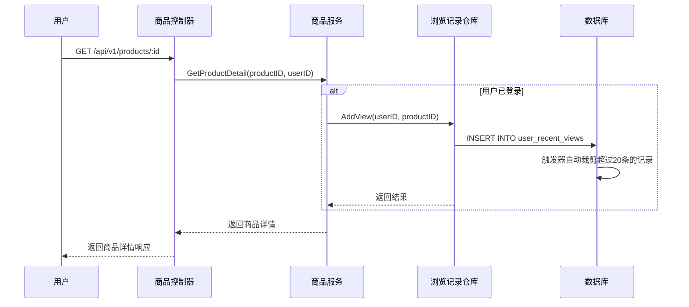
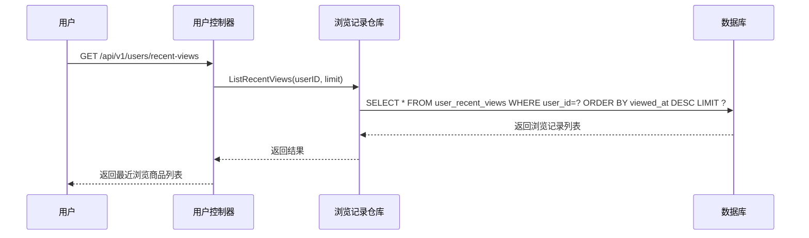

# 浏览记录模块业务逻辑分析

## 1. 概述

浏览记录模块负责记录用户对商品的浏览行为，为推荐系统提供数据基础，同时支持"最近浏览"功能。本模块采用异步记录、自动清理的策略，确保系统性能和数据合理性。

## 2. 数据库设计分析

### 2.1 表结构
```sql
CREATE TABLE user_recent_views (
    id         BIGSERIAL PRIMARY KEY,           -- 主键，自增
    user_id    BIGINT NOT NULL REFERENCES users(id) ON DELETE CASCADE,    -- 用户ID，外键
    product_id BIGINT NOT NULL REFERENCES products(id) ON DELETE CASCADE, -- 商品ID，外键
    viewed_at  TIMESTAMPTZ NOT NULL DEFAULT NOW()  -- 浏览时间，自动设置
);
```

### 2.2 索引策略
```sql
-- 复合索引，优化按用户和时间查询
CREATE INDEX idx_views_user_time ON user_recent_views (user_id, viewed_at DESC, id DESC);
```

**索引设计原因：**
- `user_id`：主要查询维度，用户查看自己的浏览记录
- `viewed_at DESC`：按时间倒序排列，获取最新浏览记录
- `id DESC`：当时间相同时，按ID倒序作为二级排序

### 2.3 自动裁剪机制
```sql
-- 触发器函数：插入后自动删除超过20条的记录
CREATE OR REPLACE FUNCTION trg_prune_user_recent_views()
RETURNS trigger AS $$
BEGIN
    DELETE FROM user_recent_views
    WHERE user_id = NEW.user_id
      AND id IN (
        SELECT id
        FROM user_recent_views
        WHERE user_id = NEW.user_id
        ORDER BY viewed_at DESC, id DESC
        OFFSET 20  -- 保留最新的20条
      );
    RETURN NULL;
END;
$$ LANGUAGE plpgsql;

-- 触发器：每次插入后执行裁剪
CREATE TRIGGER user_recent_views_prune_after_insert
AFTER INSERT ON user_recent_views
FOR EACH ROW EXECUTE FUNCTION trg_prune_user_recent_views();
```

**裁剪机制优势：**
1. **自动化**：无需应用层手动清理，减少业务复杂度
2. **高效**：在数据库层面直接操作，避免多次网络调用
3. **一致性**：保证每个用户最多20条记录，防止数据无限增长

## 3. 业务流程分析

### 3.1 浏览记录添加流程



**关键业务规则：**

1. **触发时机**：用户查看商品详情时记录浏览行为
2. **用户识别**：仅对已登录用户记录，匿名用户不记录
3. **重复浏览**：允许同一用户多次浏览同一商品，用于计算浏览频次
4. **异步处理**：记录浏览行为不影响商品详情的返回速度

### 3.2 最近浏览查询流程



## 4. 技术实现细节

### 4.1 模型定义 (`model/UserRecentView.go`)

```go
type UserRecentView struct {
    ID        int64     `json:"id" gorm:"primaryKey"`                      // 主键ID
    UserID    int64     `json:"user_id" gorm:"not null;index"`            // 用户ID（外键）
    ProductID int64     `json:"product_id" gorm:"not null;index"`         // 商品ID（外键）
    ViewedAt  time.Time `json:"viewed_at" gorm:"not null;default:now()"` // 浏览时间
}
```

**设计要点：**
- 使用 `int64` 类型对应数据库的 `BIGINT`
- GORM 标签正确映射数据库字段和约束
- `index` 标签确保查询性能

### 4.2 仓库层接口设计

```go
type ViewRecordRepository interface {
    // 添加浏览记录
    AddView(ctx context.Context, userID int64, productID int64) error
    
    // 获取最近浏览记录
    ListRecentViews(ctx context.Context, userID int64, limit int) ([]*model.UserRecentView, error)
}
```

**接口设计原则：**
1. **简单明确**：方法名清晰表达功能意图
2. **上下文支持**：所有方法支持 `context.Context` 用于超时控制和取消操作
3. **错误处理**：明确返回错误信息，便于调用方处理
4. **类型安全**：使用强类型参数，避免类型转换错误

### 4.3 实现层优化

```go
// AddView 实现添加浏览记录
func (r *viewRecordRepositoryImpl) AddView(ctx context.Context, userID int64, productID int64) error {
    view := &model.UserRecentView{
        UserID:    userID,
        ProductID: productID,
        // ViewedAt 由数据库自动设置为 NOW()
    }
    
    return r.db.WithContext(ctx).Create(view).Error
}
```

**性能优化：**
1. **数据库自动时间戳**：利用数据库 `DEFAULT NOW()` 避免时区问题
2. **批量操作支持**：GORM 的 Create 方法支持批量插入（如果需要）
3. **上下文传递**：使用 `WithContext` 确保操作可被取消

## 5. 业务价值和应用场景

### 5.1 推荐系统数据源
- **用户偏好分析**：通过浏览历史分析用户兴趣标签
- **协同过滤**：基于相似用户的浏览行为推荐商品
- **热度计算**：统计商品浏览频次，识别热门商品

### 5.2 用户体验提升
- **最近浏览**：用户可快速找到之前查看过的商品
- **浏览历史**：帮助用户回忆感兴趣的商品
- **个性化推荐**：基于浏览行为提供个性化商品推荐

### 5.3 运营分析支持
- **用户行为分析**：了解用户浏览模式和偏好
- **商品热度统计**：识别受欢迎的商品类别和特征
- **转化率分析**：分析从浏览到购买的转化情况

## 6. 性能和扩展考虑

### 6.1 性能优化策略
1. **索引优化**：复合索引支持高效的用户维度查询
2. **自动清理**：数据库触发器避免数据无限增长
3. **异步记录**：浏览记录不阻塞主要业务流程

### 6.2 扩展性考虑
1. **缓存层**：可在 Redis 中缓存热门用户的浏览记录
2. **分表策略**：用户量大时可考虑按用户ID范围分表
3. **消息队列**：高并发时可将浏览记录写入消息队列异步处理

### 6.3 数据一致性
1. **外键约束**：确保引用的用户和商品存在
2. **级联删除**：用户或商品删除时自动清理相关浏览记录
3. **事务支持**：关键操作使用事务保证数据一致性

## 7. 监控和维护

### 7.1 关键指标监控
- **浏览记录写入QPS**：监控系统负载
- **平均浏览记录数/用户**：了解用户活跃度
- **触发器执行效率**：确保自动清理性能

### 7.2 维护建议
- **定期分析慢查询**：优化查询性能
- **监控存储增长**：确保自动清理机制有效
- **备份策略**：制定合适的数据备份和恢复策略

## 8. 安全考虑

### 8.1 数据隐私
- **用户授权**：只有用户本人可以查看自己的浏览记录
- **数据脱敏**：必要时对敏感数据进行脱敏处理

### 8.2 防止滥用
- **频率限制**：防止恶意用户频繁写入浏览记录
- **参数校验**：严格校验用户ID和商品ID的合法性

这个浏览记录模块的设计充分考虑了性能、可扩展性和业务需求，为整个推荐系统奠定了坚实的数据基础。