# 校园二手交易推荐系统 - 前端

## 变更记录 (Changelog)

### 2025-11-25 00:02:47
- 初始化 AI 上下文文档
- 生成根级 CLAUDE.md 与模块结构图
- 创建 .claude/index.json 索引文件

---

## 项目愿景

为校园学生打造一个简洁易用的二手物品交易前台应用，支持商品浏览、发布、管理和智能推荐功能。基于 Vue 3 生态构建，注重类型安全和开发体验。

## 架构总览

本项目采用标准的 Vue 3 + TypeScript SPA 架构：

- **框架**: Vue 3.5 (Composition API + `<script setup>`)
- **状态管理**: Pinia 3.0
- **路由**: Vue Router 4.6
- **构建工具**: Vite 7.x
- **语言**: TypeScript 5.9
- **代码质量**: ESLint 9 + Prettier 3.6
- **HTTP 客户端**: Axios 1.13

### 路径别名

- `@/*` → `./src/*`
- `@common/*` → `../common/*` (前后端共享类型/常量)

### 目录结构

```
src/
├── api/          # API 接口定义
├── assets/       # 静态资源（样式、图片）
├── components/   # Vue 组件
├── router/       # 路由配置
├── stores/       # Pinia 状态管理
├── utils/        # 工具函数
└── views/        # 页面级组件
```

## 模块结构图

```mermaid
graph TD
    A["[根] frontend"] --> B["api/"];
    A --> C["stores/"];
    A --> D["views/"];
    A --> E["components/"];
    A --> F["utils/"];
    A --> G["assets/"];
    A --> H["router/"];

    B --> B1["user.ts - 用户认证"];
    B --> B2["product.ts - 商品管理"];
    B --> B3["home.ts - 首页数据"];
    B --> B4["category.ts - 分类"];
    B --> B5["tag.ts - 标签"];

    C --> C1["user.ts - 用户状态"];
    C --> C2["product.ts - 商品状态"];
    C --> C3["app.ts - 全局状态"];

    D --> D1["home/ - 首页"];
    D --> D2["product/ - 商品相关"];
    D --> D3["user/ - 用户中心"];
    D --> D4["category/ - 分类浏览"];
    D --> D5["search/ - 搜索结果"];

    E --> E1["common/ - 公共组件"];

    F --> F1["request.ts - HTTP 封装"];
    F --> F2["auth.ts - 认证工具"];

    G --> G1["styles/ - 全局样式"];

    click B1 "./src/api/CLAUDE.md" "查看 API 模块文档"
    click C1 "./src/stores/CLAUDE.md" "查看 Stores 模块文档"
    click D1 "./src/views/CLAUDE.md" "查看 Views 模块文档"
    click E1 "./src/components/CLAUDE.md" "查看 Components 模块文档"
    click F1 "./src/utils/CLAUDE.md" "查看 Utils 模块文档"
```



## 模块索引

| 模块路径 | 职责说明 | 关键文件 |
|---------|---------|---------|
| `src/api/` | API 接口定义与调用 | user.ts, product.ts, home.ts, category.ts, tag.ts |
| `src/stores/` | Pinia 状态管理 | user.ts (认证), product.ts (商品), app.ts (全局字典) |
| `src/views/` | 页面级组件 | home/, product/, user/, category/, search/ |
| `src/components/` | 可复用 UI 组件 | common/AppHeader.vue, common/AppFooter.vue |
| `src/utils/` | 工具函数与封装 | request.ts (Axios), auth.ts (Token) |
| `src/router/` | 路由配置 | index.ts (路由表、导航守卫) |
| `src/assets/` | 静态资源 | styles/ (theme.scss, common.scss, reset.css) |

## 运行与开发

### 环境要求

- Node.js: ^20.19.0 或 >=22.12.0
- 包管理器: pnpm (推荐)

### 常用命令

```bash
# 安装依赖
pnpm install

# 开发服务器（默认端口 5173）
pnpm dev

# 类型检查 + 构建
pnpm build

# 仅类型检查
pnpm type-check

# ESLint 检查并修复
pnpm lint

# Prettier 格式化
pnpm format
```

### 开发流程

1. 修改代码后运行 `pnpm lint` 和 `pnpm type-check` 确保代码质量
2. 使用 `<script setup>` + TypeScript 编写组件
3. API 调用统一通过 `src/api/` 中的函数
4. 状态管理优先使用 Pinia stores
5. 样式遵循 BEM 命名或 scoped 样式

## 测试策略

目前项目未配置单元测试框架，建议后续添加：

- **单元测试**: Vitest (与 Vite 集成良好)
- **组件测试**: @vue/test-utils
- **E2E 测试**: Playwright 或 Cypress

测试覆盖优先级：
1. utils/ 工具函数
2. stores/ 状态逻辑
3. api/ 接口封装
4. components/ 复用组件

## 编码规范

### TypeScript

- 严格模式开启（`strict: true`）
- 避免 `any`，优先使用明确类型或泛型
- 接口优先于类型别名（除非需要联合/交叉类型）
- 共享类型定义在 `@common/types/`

### Vue 组件

- 使用 Composition API (`<script setup lang="ts">`)
- Props 定义使用 `defineProps<T>()`
- Emits 定义使用 `defineEmits<T>()`
- 组件文件名使用 PascalCase (如 `AppHeader.vue`)

### 样式

- 主色: `#0066FF`
- 配色原则: 60-30-10（主体色-辅助色-强调色）
- 字体: Inter, -apple-system, sans-serif
- 间距基准: 4px 网格
- CSS 变量优先（见 `theme.scss`）

### 提交规范

建议使用 Conventional Commits：

```
feat: 新功能
fix: 修复 bug
docs: 文档更新
style: 代码格式（不影响功能）
refactor: 重构
test: 测试相关
chore: 构建/工具链
```

## 核心业务规则

### 商品状态机

```
ForSale（在售）↔ Delisted（已下架）
ForSale → Sold（已售，终态不可逆）
```

- `Sold` 状态一旦设置，不可变更为其他状态
- 已售商品：普通卖家不可编辑，管理员可编辑非状态字段

### 一物一件

每条商品记录代表一件实物，无库存字段，线下交易无在线支付。

### 联系卖家

- 未登录：不返回微信号，提示登录
- 登录且非卖家本人：返回完整微信号
- 卖家本人：隐藏联系入口

### 推荐算法

基于用户最近 20 条浏览记录的标签高频匹配，推荐相似商品。

## API 规范

- **前缀**: `/api/v1`
- **认证**: JWT Bearer Token（存储于 localStorage）
- **响应结构**: `{ code: number, message: string, data: T }`
- **错误码**: 0 成功，1001 参数错误，1002 未授权，1003 禁止访问，详见 `@common/constants/error_code.ts`
- **开发代理**: `/api` → `http://localhost:8080`
- **生产配置**: `VITE_API_BASE_URL` 环境变量

详细 API 文档参见：`docs/api.md`

## UI 设计规范

参考文档：`docs/前端设计说明.md`

关键要点：
- 响应式设计（最小支持 1200px 宽度容器）
- 主容器宽度：1200px
- 卡片圆角：4px
- 按钮高度：32px（默认）、40px（大按钮）
- 表单输入框高度：32px

## AI 使用指引

### 适合使用 Claude Code 的场景

1. **新增 API 接口**：基于后端 API 文档生成 TypeScript 接口和调用函数
2. **创建 Vue 组件**：根据设计稿或需求快速生成组件骨架
3. **状态管理逻辑**：编写 Pinia store 的 actions 和 getters
4. **路由配置**：添加新页面路由和导航守卫
5. **工具函数**：编写通用的格式化、验证等工具函数

### 注意事项

- 修改代码后务必运行 `pnpm lint` 和 `pnpm type-check`
- 引用共享类型时使用 `@common/types/`
- API 调用必须使用 `src/utils/request.ts` 封装的 axios 实例
- 新增页面需在 `src/router/index.ts` 注册路由
- 需要认证的路由设置 `meta: { requiresAuth: true }`

### 推荐提示词模板

```
请基于以下需求创建 [组件/API/Store]：
- 功能：[描述]
- 输入：[参数/Props]
- 输出：[返回值/Emits]
- 依赖：[关联的类型/API]
- 样式：[参考 theme.scss 中的 CSS 变量]

请确保代码符合项目的 TypeScript 和 ESLint 规范。
```

## 数据库关键表（后端参考）

| 表名 | 说明 |
|------|------|
| users | 用户（学生/管理员） |
| products | 商品（status: ForSale/Sold/Delisted） |
| product_images | 商品图片（is_primary 标记主图） |
| categories | 商品分类 |
| tags | 标签 |
| product_tags | 商品-标签多对多关联 |
| user_recent_views | 最近浏览（自动裁剪到 20 条） |
| product_conditions | 新旧程度枚举 |

## 相关文档

- [API 接口文档](../docs/api.md)
- [前端设计说明](../docs/前端设计说明.md)
- [前端开发任务](../docs/前端开发任务.md)

---

**最后更新**: 2025-11-25 00:02:47
